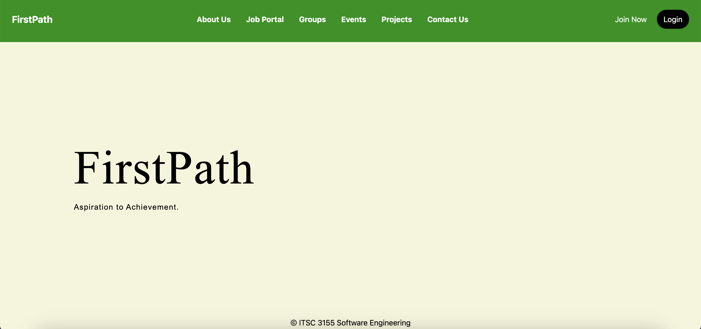

# FirstPathFinalProject
Overview: FirstPath is a career guidance platform tailored for students and fresh graduates. It provides tools and resources to help users showcase their skills, connect with like-minded individuals, and navigate the job market with ease.

# Key features include:
1. Personalized profiles to highlight skills and projects.
2. A project showcase page for displaying practical work.
3. Event calendars for networking opportunities and career growth.
4. Groups for connecting with peers and professionals with similar interests.
5. A job search page with advanced filtering options.

# Tech Stack
- Frontend: HTML, CSS
- Backend: Django (Python)
- Database: SQLite (Development)
- Other Tools: Bootstrap (for responsive design), Git for version control

